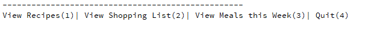
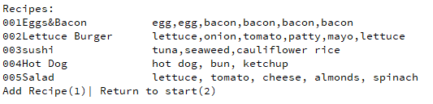
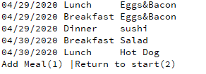
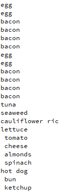

# KetoMealTracker
Putting into practice some COBOL code to manage meals and create shopping list

COBOL (common business-oriented language) is an english like programming language that is meant for buisness use. The problem is that COBOL is a 1950's era language which means many developers my age haven't seen or heard of it, failing to replace the generations of COBOL programmers that are retiring.

Having heard about this I not only thought it would be a nice oportunity to learn a new language but also increase the amount of COBOL engineers minutely.

This is a simple program written in OpenCobolIDE to track and manage the new Keto diet Im trying as well as help manage my grocerie list because in my experience if I fail to stick to the list im bringing home a snack.

The program starts with a simple interface.

One can view/add recipes.

And view/add things to the menu. The menu uses the DATE functions in COBOL to only show the week ahead so one can plan further ahead but it just wont be displayed until its within a week.

Then once youre satisfied with the menu you can view the shopping list for that week. 

This is the first version of this program and it does what its supposed to but there are very obvious changes that I intend to make like the ability to delete recipies/menu items and condensing the shopping list so that it says something like.

4 egg
8 bacon
1 tuna
1 cauliflower rice
1 seaweed
